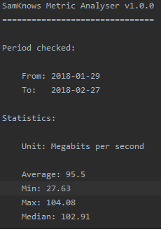

# Metric Analyser

### Pre-requisites

- Spring Boot 2.5.5 https://spring.io/projects/spring-boot
- JDK 11
- Camel 3.11.1 https://camel.apache.org/docs/

## Introduction

The scope of this project is to generate pre format files with a series of statistical information and store them in the 'outputs' folder after analyzing the data in the files which are stored in 'inputs' folder.

## What the application does

The application processes a file json that contains the following information to analyze: 
- dtime: represents the date of the measurements
- metricValue: represents the measurement in byte per second

The final result is a file that will be stored in a folder called outputs.  It contains the following value of the metric:
- Minimun 
- Maximun 
- Average or mean 
- Median
- If performances are low it will show an extra information regarding the period when it happened.

### Assumptions

- We will assume that if the metric is below 33% of the maximum value it will be underperforming.
- We will assume that under performing happen rarely.
- We will assume that the underperformance periods are continuous.
 
### Formula

Average = Sum of metricValues/ Number of metricValues

Median =   when the size of elements is odd.

Median =  when the size of elements is even.

## Result

A pre-format output will be written in a file whose name is the same as the file json and the extension is changed from json to ouput.
The numeric value are in Megabits per second.  Therefore, a conversion from bytes per second to Megabits per second will be there.

 
