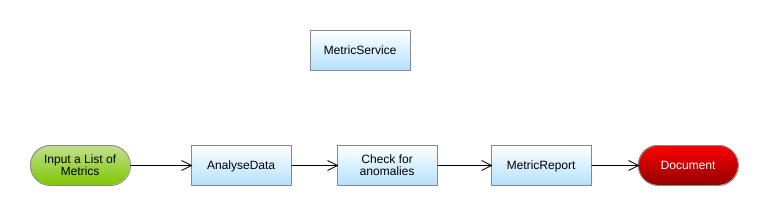

# Metric Analyser

### Pre-requisites

- Spring Boot 2.5.5 https://spring.io/projects/spring-boot
- JDK 11
- Camel 3.11.1 https://camel.apache.org/docs/

## Introduction

The scope of this project is to generate preformatted file with a series of statistical information and store them in the '<i>outputs</i> folder after analyzing the data in the files which are stored in <i>inputs</i> folder.

## What the application does

The application processes a file json which contains the following information to be analyzed: 
- dtime: represents the date of the measurements
- metricValue: represents the measure in byte per second

The final result is a file that will be stored in a folder called <i>outputs</i>.  It contains the following value of the metric:
- Minimun 
- Maximun 
- Average or mean 
- Median
- If performances are low it will show an extra information regarding the period when it happened.

### Flow

#### General Behaviour

#### Flowchart of the Business Logic (Processes information block)

### Assumptions

We will assume the following:

- If the metric is below 33% of the maximum value it will be underperforming.
- Under performing happen rarely.
- The underperformance periods are continuous.
 
### Formula

Average = Sum of metricValues/ Number of metricValues

Median =   when the size of elements is odd.

Median =  when the size of elements is even.

## Result

A pre-format output will be written to a file whose name is the same as the json file and the extension will change from json to ouput.
The numerical values are in Megabits per second.  Therefore, there will be a conversion from bytes per second to Megabits per second.

 
